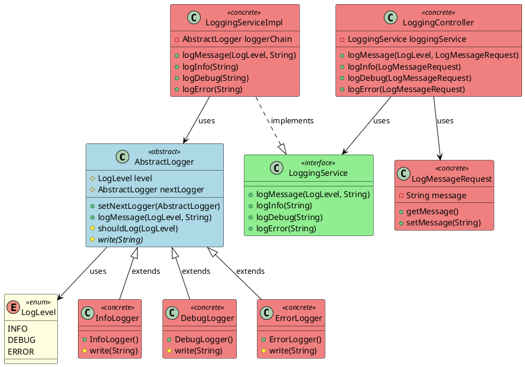

# Chain of Responsibility Pattern - Logging System

This project demonstrates the implementation of the Chain of Responsibility design pattern in a logging system using Spring Boot. The system provides a flexible and extensible way to handle log messages at different severity levels (INFO, DEBUG, ERROR).

## Table of Contents
- [Design Pattern Overview](#design-pattern-overview)
- [Class Diagram](#class-diagram)
- [Implementation Details](#implementation-details)
- [API Documentation](#api-documentation)
- [Getting Started](#getting-started)

## Design Pattern Overview

The Chain of Responsibility pattern is a behavioral design pattern that allows an object to pass a request along a chain of potential handlers. Upon receiving a request, each handler decides either to process the request or to pass it to the next handler in the chain.

### Key Components
1. **Handler Interface/Abstract Class**: Defines the interface for handling requests and implements the successor link
2. **Concrete Handlers**: Implement the handling of requests they are responsible for
3. **Client**: Initiates requests to the chain

### Benefits
- Reduces coupling between sender and receivers
- Adds flexibility in assigning responsibilities to objects
- Allows dynamic changes to the chain
- Single Responsibility Principle: Each handler focuses on its specific task
- Open/Closed Principle: New handlers can be added without modifying existing code

## Class Diagram



## Implementation Details

### Core Components

1. **AbstractLogger**
   - Base class for all loggers
   - Implements the chain of responsibility logic
   - Defines the interface for handling log messages
   - Manages the successor link through `nextLogger`

2. **Concrete Loggers**
   - `InfoLogger`: Handles informational messages
   - `DebugLogger`: Handles debug messages
   - `ErrorLogger`: Handles error messages
   - Each logger implements its own `write` method

3. **Log Level Hierarchy**
   - ERROR (2): Highest priority
   - DEBUG (1): Medium priority
   - INFO (0): Lowest priority

### Message Flow
1. A log message is received with a specific level
2. The message starts at the head of the chain (ErrorLogger)
3. Each logger in the chain:
   - Checks if it should process the message based on its level
   - Processes the message if appropriate
   - Passes the message to the next logger

### Spring Integration
- `LoggerConfig`: Configures the logger chain as a Spring bean
- `LoggingService`: Defines the service interface
- `LoggingServiceImpl`: Implements the service using the logger chain
- `LoggingController`: Exposes REST endpoints for logging

## API Documentation

### Endpoints

1. **Log Message with Specific Level**
   ```
   POST /api/logs/{level}
   ```
   - `level`: INFO, DEBUG, or ERROR
   - Request body: `{ "message": "Your log message" }`

2. **Log Info Message**
   ```
   POST /api/logs/info
   ```
   - Request body: `{ "message": "Your info message" }`

3. **Log Debug Message**
   ```
   POST /api/logs/debug
   ```
   - Request body: `{ "message": "Your debug message" }`

4. **Log Error Message**
   ```
   POST /api/logs/error
   ```
   - Request body: `{ "message": "Your error message" }`

### Swagger UI
Access the API documentation at: `http://localhost:8080/swagger-ui.html`

## Getting Started

### Prerequisites
- Java 21
- Maven
- Spring Boot 3.5.0

### Running the Application
1. Clone the repository
2. Build the project:
   ```bash
   mvn clean install
   ```
3. Run the application:
   ```bash
   mvn spring-boot:run
   ```

### Example Usage

1. Log an error message:
   ```bash
   curl -X POST http://localhost:8080/api/logs/error \
     -H "Content-Type: application/json" \
     -d '{"message": "Database connection failed"}'
   ```

2. Log a debug message:
   ```bash
   curl -X POST http://localhost:8080/api/logs/debug \
     -H "Content-Type: application/json" \
     -d '{"message": "Processing request ID: 123"}'
   ```

3. Log an info message:
   ```bash
   curl -X POST http://localhost:8080/api/logs/info \
     -H "Content-Type: application/json" \
     -d '{"message": "Application started successfully"}'
   ```

## Logging Behavior

When a message is logged at a specific level, it is processed by all loggers in the chain that can handle that level or higher:

- ERROR messages are processed by all loggers (ERROR → DEBUG → INFO)
- DEBUG messages are processed by DEBUG and INFO loggers
- INFO messages are only processed by the INFO logger

Example output for an ERROR message:
```
ERROR: Database connection failed
DEBUG: Database connection failed
INFO: Database connection failed
``` 